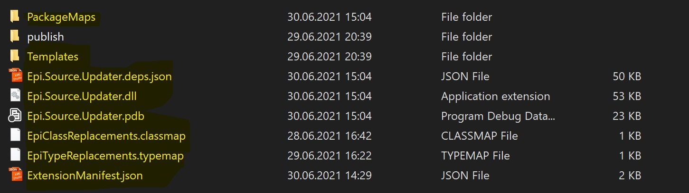
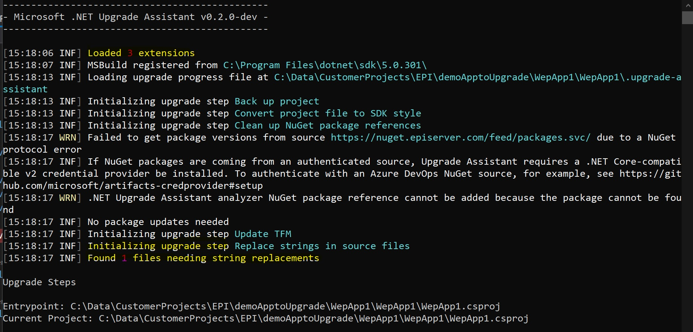
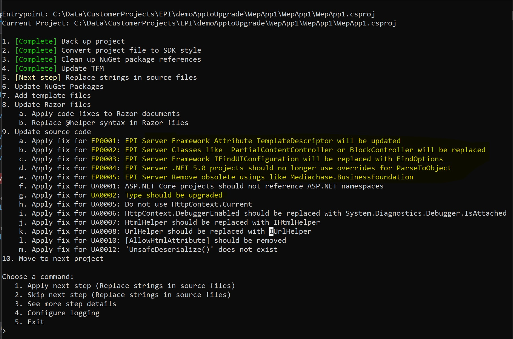

# Upgrade Assistant source updater with EPI Server extension

This demonstrates how to add and execute the EPI Server Extension. 
The Extension is an addon which analyzes and updates Source Files eg. for the EPI Server Foundation project. 

## Installation

### Upgrade Assistant
Install the upgrade-assistant dotnet tool from [Upgrade-Asstant](https://dotnet.microsoft.com/platform/upgrade-assistant)
**dotnet tool install -g upgrade-assistant**
Update the upgrade-assistant to a newer version. 
**dotnet tool update -g upgrade-assistant**

Note: 
make sure you are using the latest available version of upgrade-assistant. 
eg. 
Support for Extension ZIP Files is available from v0.2.231403…… 

### Epi Server Extension
Download Source Code and rebuild it using Visual Studio 2019: [EPI Server Upgrade-Assistant-Extension](https://github.com/episerver/upgrade-assistant-extensions/tree/develop) 

If successfully rebuilt, take the extension Files and copy them to another place on your local machine: 
eg. 
 from ..\src\SourceUpdater\bin\Debug\netstandard2.0  to  c:\EPI-Extension\  

Or also zip those Files into a .zip File, eg. EPI.SourceCode.Updater.zip.  
This Zip File might then be provided be a good way of how to distribute the EPI Server extension to the customers. 

 
## Execution
Open up "Developer Command line Tool". 

Run the "upgrade-assistant" tool by referencing the EPI Server Extension.
Specify either the Solution (.sln) or Project (.csproj) you want to upgrade, and add the --extension parameter with the path to the EPI Server Extension.

upgrade-assistant upgrade C:\<full-path>\DemoProject.csproj  **--extension "C:\EPI-Extension**"

using a zip file: 
upgrade-assistant upgrade C:\<full-path>\DemoProject.csproj  **--extension "C:\EPI-Extension\EPI.SourceCode.Updater.zip**"

The Upgrade-assistant starts and you'll notice at the bottom that it tells you that strings are found to be replaced.
String you want ot replace are configured in the ExtensionManifest.json file. see below.

The upgrade-assistant will show additional Update source code steps "apply fix for", where the extension analyzers have found areas such updates are to be applied. 
these are 5 additional code fixes identified with EP0001 - EP0005, representing EP = EPI Server related fixes. 

UA0002 is an out of the box update step, but the EPI Server Type mappings see below, are executed during this step. 

### Capabilities
The EPI Server Extension provides some EPIServer specific capabilities: 

1. String Replacement 
2. Remove Default Argument for the TemplateDescriptor Attribute
2. Base Class Mapping
3. Replace IFindUIConfiguration with FindOptions 
4. Remove PropertyData ParseToObject method overrides
5. Remove obsolete using statements like Mediachase.BusinessFoundation
6. Type Mapping like EPiServer.Web.Routing to EPiServer.Core.Routing 

Additionaly Nuget Packages can be specified: 

"Name": "EPiServer.CMS.Core",
"Version": "11.99.99"

and Tamplates for Program.cs and Startup.cs as they are required by .NET 5.0 can be added as well.

### Not Configurable
some features as below are not configurable and will be executed, you can still skip the execution during the dialog.

- Remove Default Argument for the TemplateDescriptor Attribute 
- Remove obsolete using statements
- Remove obsolete method overrideusing statements
- Replace IFindUIConfiguration with FindOptions 

### Confuguration
Type, Base Class Mapping, Packages, Templates and also String Replacements can be configured.  

####Specify new EPI related Types in the **.typemap** File, by adding the old type space/tab followed by the new type:

`# These mappings represent EPI Server types that should be replaced when upgrading to .NET 5.0.

EPiServer.Web.Routing	EPiServer.Core.Routing  
Foundation.Commerce.Markets   Foundation.Infrastructure.Commerce.Markets`

####Specify new EPI related base classes in the **.classmap** File, by adding the old class space/tab followed by the new class:

`# These mappings represent EPI Server base classes that should be replaced when upgrading dotNet 5

BlockController	BlockComponent  
PartialContentController   PartialContentComponent`

####Replace any strings you want.  This a quick and dirty approach if you want to have any source code quickly replaced by anything else.  
Update the **ExtensionManifest.json** File and specify old value followed by the new Value. This could also be used if you want to comment out some lines. Eg. 

samples:

`  "FindReplaceOptions": {  
    "Replacements": {  
 "[AcceptVerbs(HttpVerbs.Get | HttpVerbs.Post)]": "[AcceptVerbs(new string[] {\"GET\",\"POST\" })]"
    }
  },`

####Package Mamangement 
go to the PackageMaps/EPIServerPackageMaps.json file and configure required package upgrades and versions as need for .NET 5.0. 

  {
"PackageSetName": "EPiServer",
"NetFrameworkPackages": [
  {
"Name": "EPiServer.CMS.AspNet",
"Version": "*"
  },
  {
"Name": "EPiServer.CMS.Core",
"Version": "11.99.99"
  },

####Templates
the Program.cs and the Starup.cs are important Templates required by ASP.NET core projects. They will automatically be added to the project if not already existing.
go to Templates\EPiServerTemplates and customize the Program.cs and the Startup.cs to your needs. 

## General Description ##
While running, Upgrade Assistant's source updater step will look in the dependency injection container for any analyzers or code fix providers. It then creates sub-steps for each analyzers/code fix provider pair it finds. So, extensions (like this one) can add their own analyzers and code fix providers and register them for use with an `IExtensionServiceProvider`.

Custom source updates to Upgrade Assistant using Roslyn analyzers and code fix providers. You can learn how to create Roslyn analyzers and code fix providers in [Roslyn documentation](https://docs.microsoft.com/visualstudio/extensibility/getting-started-with-roslyn-analyzers).
