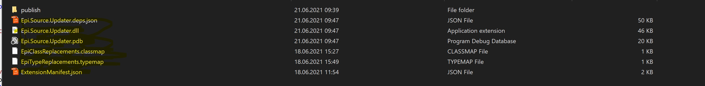
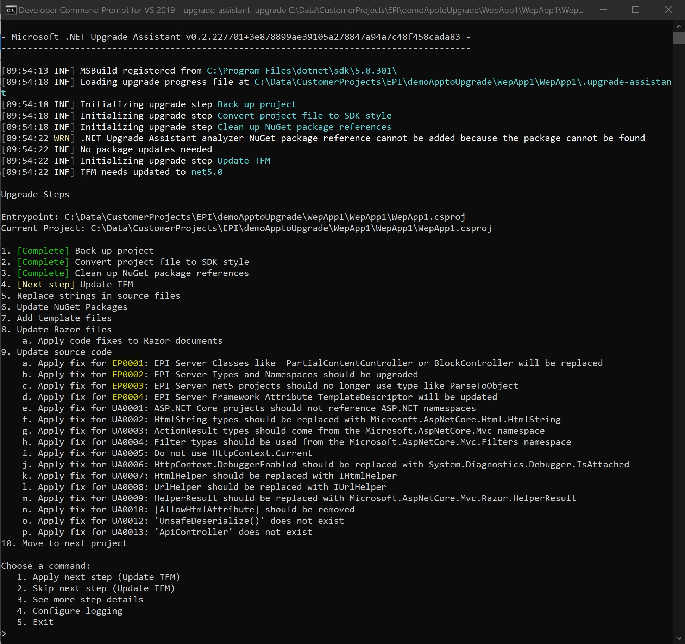

# Upgrade Assistant source updater with EPI Server extension

This demonstrates how to add and execute the EPI SErver Extension. 
The Extension is an addon which analyzes and updates Source Files, specified in he EPI SErve extension. 

## Installation

### Upgrade Assitantan
Install the upgrade-assistant dotnet tool from [Upgrade-Asstant](https://dotnet.microsoft.com/platform/upgrade-assistant)
**dotnet tool install -g upgrade-assistant**

### Epi Server Extension
Download Source Code and Rebuild it using Visual Studion 2019: [EPI Server Upgrade-Assistant-Extension](https://github.com/episerver/upgrade-assistant-extensions/tree/develop) 

If successfully rebuilt, take the extension Files and copy them to another place on your local machine: 
eg. 
 from ..\src\SourceUpdater\bin\Debug\netstandard2.0  to  c:\EPI-Extension\  

 
## Execution
open up Developer Command line Tool: 

run the upgrade-assistant tool by referencing the EPI Extension 
Specify the either The Solution or Project you want to upgrade, and add the --extension parameter with the path the EPI Server Extension.

upgrade-assistant upgrade C:\Data\CustomerProjects\EPI\demoApptoUpgrade\WepApp1\WepApp1\WepApp1.csproj  **--extension "C:\EPI-Extension**"

### Capabilities
The EPI Server Extension provides a couple of EPI Secific capabilits: 

- Type Mapping
- Base Class Mapping  
- String Replacement 
- Remove PropertyData.ParseToObject method 
- Remove Default Argument for the TemplateDescriptor Attribute 

### Confuguration
Type and Base Class Mapping and also String Replacements can be configured and can therefore be used for other mappings as well. 

Specify new EPI repalted Types in the .typemap File, by adding the old type space/tab followed by the new type:

`# These mappings represent EPI Server types that should be replaced when upgrading to ASP.NET Core

EPiServer.Web.Routing	EPiServer.Core.Routing  
Foundation.Commerce.Markets   Foundation.Infrastructure.Commerce.Markets`

Type and Base Class Mapping and also String Replacements can be configured and can therefore be used for other mappings as well. 

Specify new EPI repalted base classes in the .classmap File, by adding the old class space/tab followed by the new class:

`# These mappings represent EPI Server base classes that should be replaced when upgrading dotNet 5

BlockController	BlockComponent  
PartialContentController   PartialContentComponent`

Replace any string you want.  This a quick and dirty approach if you want to have any source code quickly repalced by anything else.  
Update the ExtensionManifest.json Files and specify old value followed by the new Value. This could also be used if you want to comment out some lines. Eg. 

IFindUIConfiguration findUIConfiguration,   
//IFindUIConfiguration findUIConfiguration,

samples:

`  "FindReplaceOptions": {  
    "Replacements": {  
      "// TODO": "// Updated todo",  
      //"[TemplateDescriptor(Default = true)]": "[TemplateDescriptor]",  
      "[AcceptVerbs(HttpVerbs.Get | HttpVerbs.Post)]": "[AcceptVerbs(new string[] {\"GET\",\"POST\" })]"
      //"PartialContentController<": "PartialContentComponent<",
      //"BlockController<": "BlockComponent<"
    }
  },`

## General Description ##
While running, Upgrade Assistant's source updater step will look in the dependency injection container for any analyzers or code fix providers. It then creates sub-steps for each analyzers/code fix provider pair it finds. So, extensions (like this one) can add their own analyzers and code fix providers and register them for use with an `IExtensionServiceProvider`.

Custom source updates to Upgrade Assistant using Roslyn analyzers and code fix providers. You can learn how to create Roslyn analyzers and code fix providers in [Roslyn documentation](https://docs.microsoft.com/visualstudio/extensibility/getting-started-with-roslyn-analyzers).